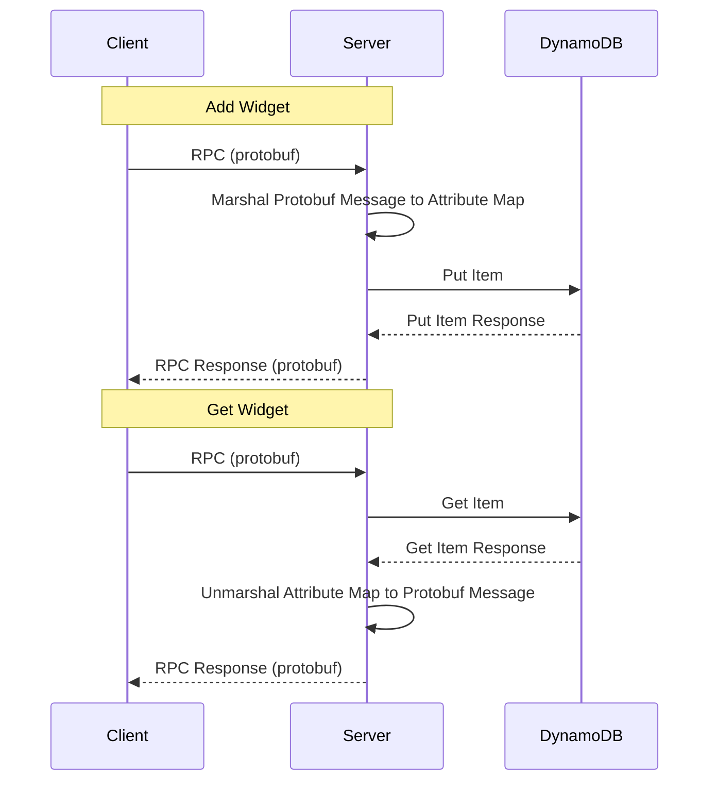
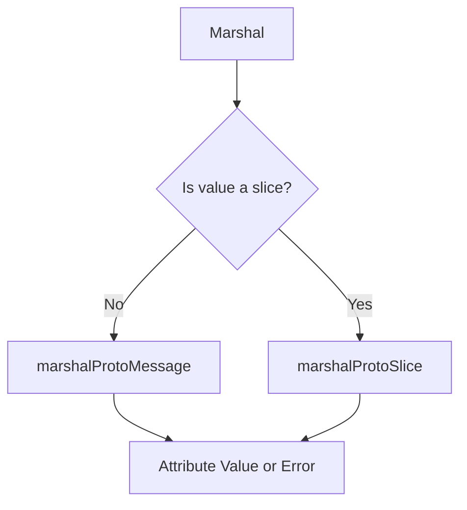
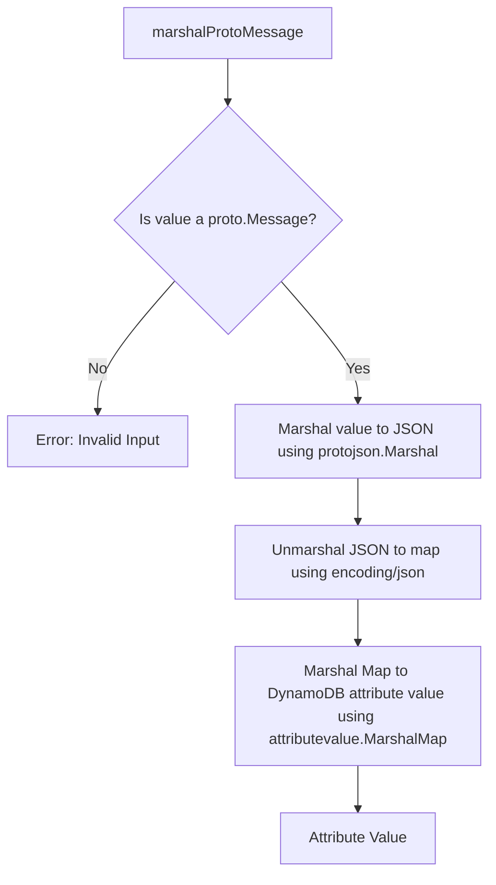
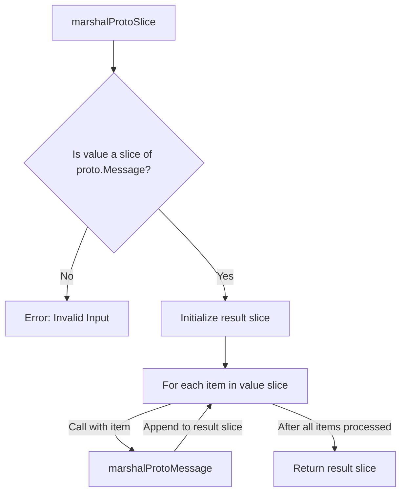

# dynabuf
 
**Dynabuf** converts [Protocol Buffers] to [attribute maps] for [DynamoDB], 
and back again.
 
[Protocol Buffers]: https://developers.google.com/protocol-buffers
[DynamoDB]: https://aws.amazon.com/dynamodb/
[attribute maps]: https://docs.aws.amazon.com/amazondynamodb/latest/APIReference/API_AttributeValue.html

## Installation

```console
$ go get -v github.com/picatz/dynabuf@latest
```

## How Does It Work?

Dynabuf uses [`protojson`] as a logical intermediate between Protocol Buffers 
and DynamoDB attribute maps. This allows for a [standard conversion] between 
the two data formats, so you can easily store Protocol Buffer defined objects
in DynamoDB without sacrificing the ability to query them. No manual
field mapping or [`protoc`] plugins required.

> [!IMPORTANT]
>
> This library is designed to be used with the [AWS SDK for Go] (v2).

[`protojson`]: https://pkg.go.dev/google.golang.org/protobuf/encoding/protojson
[`protoc`]: https://protobuf.dev/reference/other/#plugins
[standard conversion]: https://protobuf.dev/programming-guides/proto3/#json
[AWS SDK for Go]: https://aws.amazon.com/sdk-for-go/










## Usage

You define a Protocol Buffer message, generate the corresponding Go struct,
and then use the `Marshal` and `Unmarshal` functions to convert between 
the Protocol Buffer message and a DynamoDB attribute map.

[generate]: https://buf.build/docs/reference/cli/buf/generate

```protobuf
syntax = "proto3";

package example;

message User {
  string id = 1;
  string name = 2;
  string email = 3;
}
```

```go
resp, _ := dynamoClient.CreateTable(
	ctx,
	&dynamodb.CreateTableInput{
		AttributeDefinitions: []types.AttributeDefinition{
			{
				AttributeName: aws.String("id"),
				AttributeType: types.ScalarAttributeTypeS,
			},
		},
		KeySchema: []types.KeySchemaElement{
			{
				AttributeName: aws.String("id"),
				KeyType:       types.KeyTypeHash,
			},
		},
		TableName:   aws.String(table),
		BillingMode: types.BillingModePayPerRequest,
	},
)

user := &example.User{
    Id: "123",
    Name: "John Doe",
    Email: "...",
}

item, _ := dynabuf.Marshal(user)

dynamoClient.PutItem(ctx, &dynamodb.PutItemInput{
	TableName: tableName,
	Item:      item,
})

output, _ := dynamoClient.GetItem(ctx, &dynamodb.GetItemInput{
	TableName: tableName,
	Key: map[string]types.AttributeValue{
		"id": &types.AttributeValueMemberS{Value: user.Id},
	},
})

outputProto := &example.User{}
dynabuf.Unmarshal(output.Item, outputProto)

fmt.Println(outputProto)
// &example.User{Id: "123", Name: "John Doe", Email: "..."}
```

> [!TIP]
>
> The `Marshal` and `Unmarshal` functions can be used to convert single
> messages or a slice of messages. This is particularly useful when working
> with batch operations in DynamoDB, where you may need to convert multiple
> attribute maps at once, without the extra loop logic.